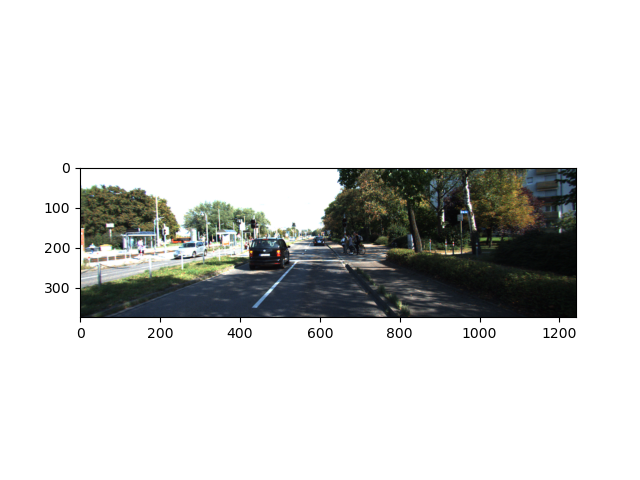

# 大作业-物体检测-点云部分pipelines

本次物体检测piplines主要分为以下三个部分：**数据准备**，**Pointnet物体分类网络训练**，**点云目标检测**

## 数据准备

水平有限，代码参考自github以及博客，并对其进行了整合、理解和详细注释，数据准备的整体工作流程如下:

1. 下载kitti官方数据集，包括雷达点云数据集，左图彩色图数据集，左图标签数据集，相机矫正数据集
2. 对于每一帧相互关联的点云，图像，标签，相机矫正数据进行以下操作
   * 地面分割，提取出非地面部分的点云，并对非地面的点云进行DBSCAN聚类
   * 遍历对应标签中的每一行
   * 根据每一行中的3D物体检测框的中心点坐标，过滤调中心坐标距离雷达坐标系中心大于一定距离的分类（这里的阈值选择45米），因为距离雷达中心太远的物体点云的点数太少，对于训练分类网络是没有意义的
   * 提取以检测框最长对角线为半径的范围内的所有点云
   * 根据相机矫正矩阵和2D物体检测框对点云进行滤波，获取到所有处于2D物体检测框中的点云（这里获取到的点云就与雷达可以检测到的点云有了区别，位于相机视角外的点云即使可以被雷达看到这里也不会被获取）
   * 对检测框中的点云进行非极大值抑制，获取到点数最多的类别
   * 保存非极大值抑制后的点云，并将label的标签作为点云的标签

最后获取到的数据集如下，其中红色代表汽车，蓝色代表自行车，绿色代表行人

|                 相机视角                 |                     点云视角                     |
| :--------------------------------------: | :----------------------------------------------: |
|                |  |
|  |  |
|                |  |

从图中可以看出，数据集的提取是正确的

## 数据增强

对属于各个类别的数据的数目进行统计，结果如下

从图中可以看出，各个类别的数量分布极度不均匀，为了保证模型训练过程的稳定性，需要进行数据增强，这里选择对类别数量较少的类别进行随机绕z轴随机旋转增强。经过数据增强后，数据分布如下

## PointNet物体分类模型训练

使用tensorflow编写pointnet代码，并对生成的数据集进行训练，结果如下

## Kitti数据集预测

对kitti官方物体检测数据集进行预测，流程如下

* 对于每一帧点云进行地面分割
* 对分割出来的非地面物体进行DBSCAN聚类
* 对聚类出来的每一个聚类进行重采样
* 对重采样的点使用分类网络进行分类
* 对重采样后的点输出为kitti的label格式

结果如下

|       相机视角       |                     点云视角                      |
| :------------------: | :-----------------------------------------------: |
|   |  |
|  |  |
|  |  |

kitti官方评估工具的结果如下

总结，根据上图所示结果可以看出，物体检测流程大体是工作正确的，但是通过可视化观察实验结果，发现对于有遮挡的物体的检测效果不佳。