# Object Detection on KITTI Autonomous Driving Scenes Based on YOLOv5 and PointNet

[中文版本](https://github.com/Longxiaoze/YOLOv5_and_pointnet_for_object_detection_on_kitti/blob/main/README_cn.md)

YOLOv5_and_pointnet_for_object_detection_on_kitti

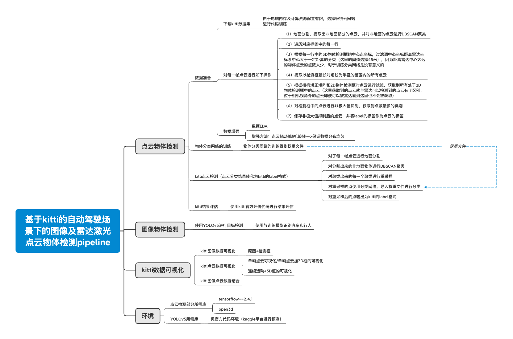

## Abstract

In recent years, the rapid development of artificial intelligence has significantly advanced autonomous driving, garnering increasing attention from researchers and society. In this project, we developed an object recognition system for images and radar point clouds based on the public KITTI autonomous driving dataset. For image object detection, we employed YOLOv5 as the detection network. Using the YOLOv5x model (the largest, most effective, but slowest model) on the Kaggle platform with a Tesla P100-PCIE-16GB, the average detection time per image was 0.044s, achieving 22.73 FPS with excellent detection results. For radar point cloud object detection, due to the unique nature of point cloud data, we segmented the ground using an algorithm, clustered the remaining points to identify objects, and classified these objects using the PointNet point cloud classification network, converting them into detection boxes. This approach yielded good results in the KITTI official evaluation code. Additionally, we visualized the results, including projecting images onto point clouds and vice versa. Finally, we discussed some limitations and future improvement directions.

Complete code available on [GitHub (click to enter)](https://github.com/Longxiaoze/YOLOv5_and_pointnet_for_object_detection_on_kitti)

Code with partial datasets available on [Baidu Netdisk (click to enter)](https://pan.baidu.com/s/1tjJuhY47BHEms3uokNnvIg)

Link: https://pan.baidu.com/s/1tjJuhY47BHEms3uokNnvIg

Password: sda6

## 2D Object Detection on KITTI Dataset Based on YOLOv5

Code: [Reproduction on Kaggle](https://www.kaggle.com/longxiaoze/yolov5-in-kitti-detection/notebook)

For the image side, we used YOLOv5 as the 2D object detection model, utilizing the official pre-trained model on the COCO dataset for detection on the KITTI public dataset. The experimental results confirmed its accuracy and recall rate, achieving good image detection results.

## Object Detection Under Point Cloud Classification Network Based on PointNet

Code: [GitHub](https://github.com/Longxiaoze/YOLOv5_and_pointnet_for_object_detection_on_kitti)

Main ideas:
1. Segment the ground from the point cloud using non-deep learning methods.
2. Cluster the remaining point cloud points above the ground.
3. Classify the clustered point cloud using PointNet.
4. Convert the classified point cloud data into 3D detection boxes.

## Data Visualization of Object Detection

In the final part, to facilitate the work and future data integration, we visualized the data, including but not limited to:
1. Visualization of the original image and point cloud data.
2. Visualization of image + 2D detection box.

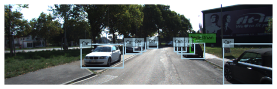

3. Visualization of image + 3D detection box.

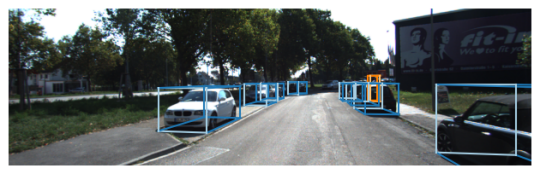

4. Visualization of point cloud + 3D detection box.

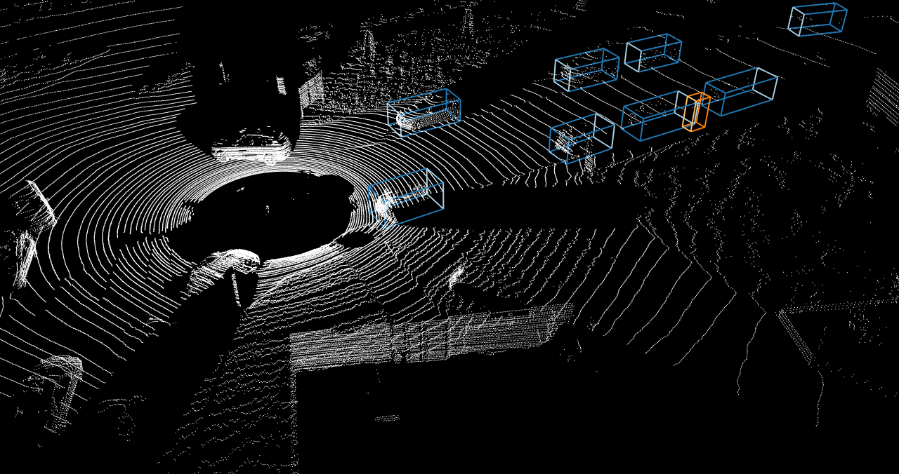

5. Visualization of image RGB values projected onto the point cloud.

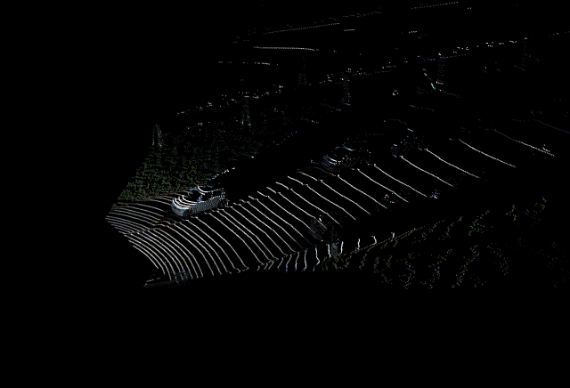

6. Visualization of point cloud projected onto the image.

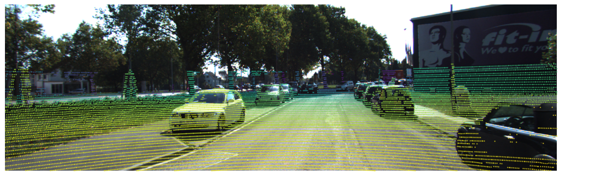

7. Visualization of point cloud ground segmentation results.

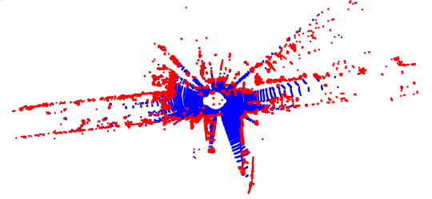

8. Visualization of point cloud segmentation results.

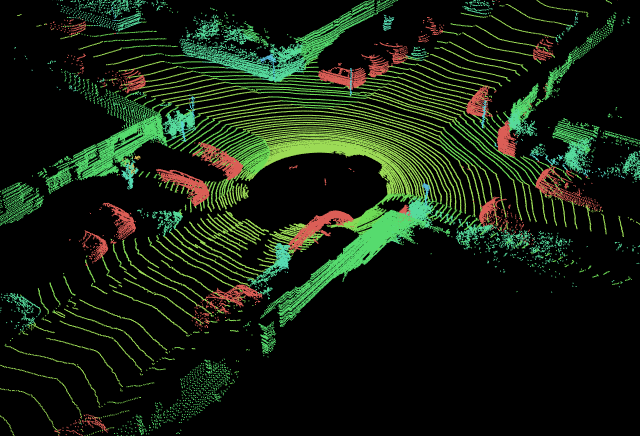

9. Visualization of point cloud consecutive frame detection GIF.

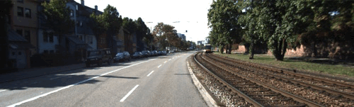

10. Video detection GIF visualization.

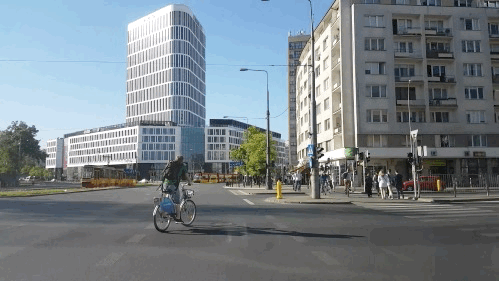

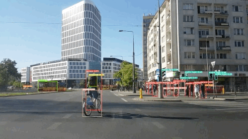
